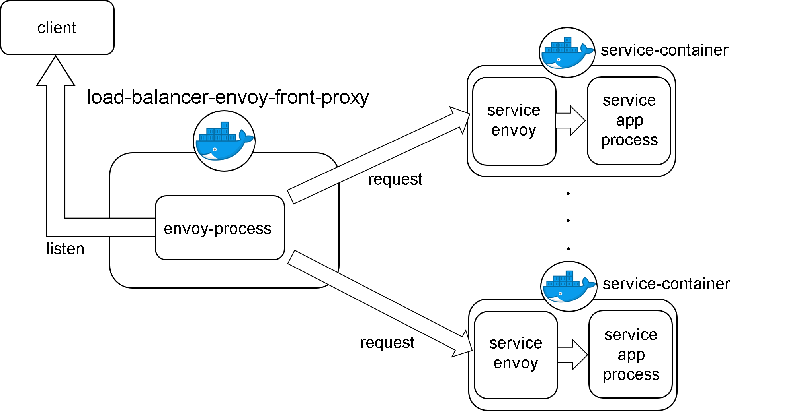

# load-balancer-for-movable-devices
load-balancer-for-movable-devicesは、主にエッジコンピューティング環境において、モバイル端末であるクライアント群の要求に応じて、エッジ端末内における指定されたサービスとのネットワーク通信を制御仲介します。  
load-balancer-for-movable-devicesは、エッジ端末への、外部の複数のモバイル端末からのネットワーク通信を制御仲介するために、利用されます。  
load-balancer-for-movable-devicesは、envoy proxyを利用したload-balancerです。(envoy: https://www.envoyproxy.io/)  
load-balancer-for-movable-devicesは、クライアントである複数のモバイル端末側から要求を受取った際、指定されたサービスとのネットワーク通信を制御仲介することで、エッジ端末における各サービスコンテナとの安定的な通信を可能にします。  
  
# 動作環境
load-balancer-for-movable-devicesは、Kubernetes上での動作運用を前提としています。
```
OS: Linux
Kubernetes
AION

最低限スペック
CPU: 2 cores
memory: 4 GB
```
  
# 起動方法
このリポジトリをクローンし、必要に応じenvoy-load-balancer.yamlの設定を置き換えてください。
書き換えが必要な箇所は次のとおりです。

```
- endpoint:
    address:
      socket_address:
        address: ポッド名
        port_value: ポート番号
```

そして、docker imageをbuildしてください。  
```
$ cd /path/to/load-balancer-for-movable-devices  
$ make docker-build
```

AION で 起動する場合、aion-service-definitions の services.yml には下記のように記載してください。
```
  load-balancer-for-movable-devices:
    scale: 1
    startup: yes
    always: yes
    network: NodePort
    ports:
      - name: proxy
        protocol: TCP
        port: 30600
        nodePort: 30600
```
  
# 環境変数  
| 環境変数名         | 設定値の例                            | 
| :---------------: | :---------------------------------: | 
| REPOSITORY_PREFIX | "prefix"                            | 
| SERVICE_NAME      | "load_balancer_for_movable_devices" | 


# システム構造
